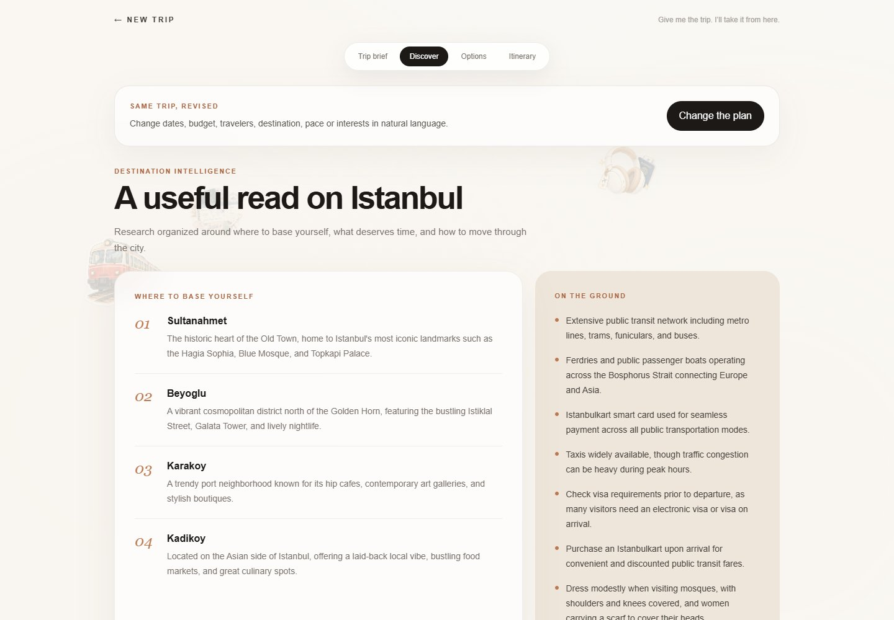
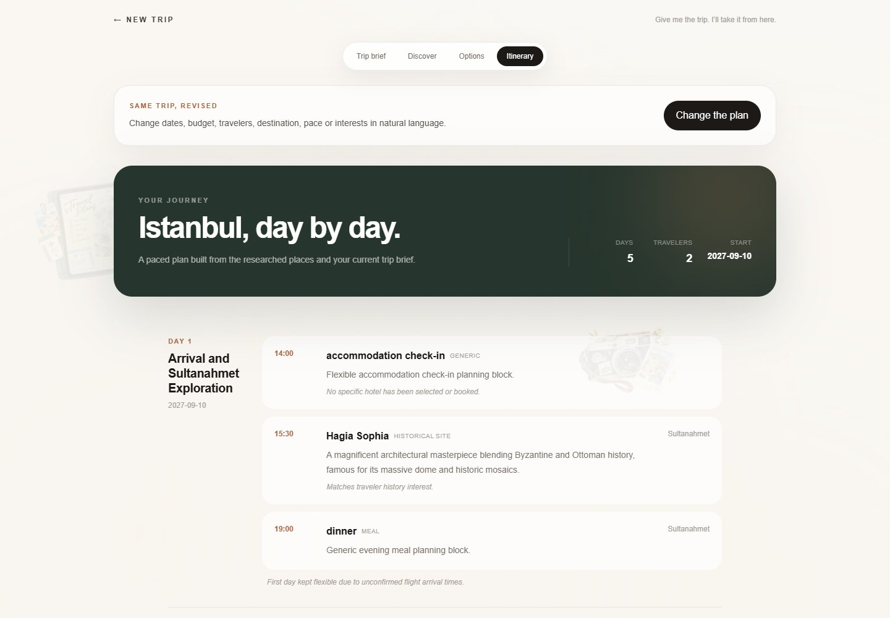
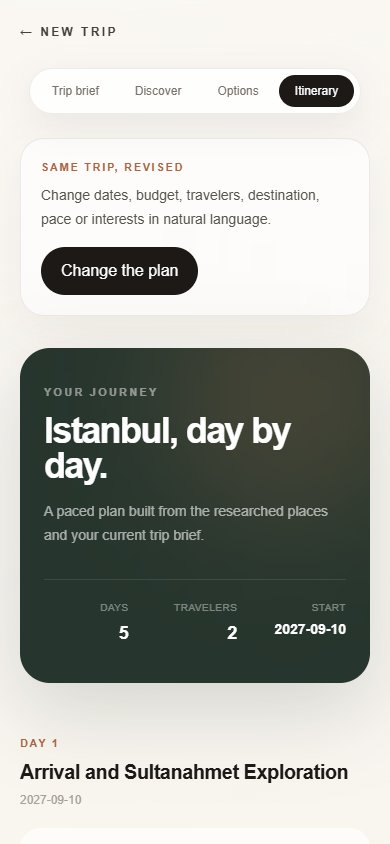
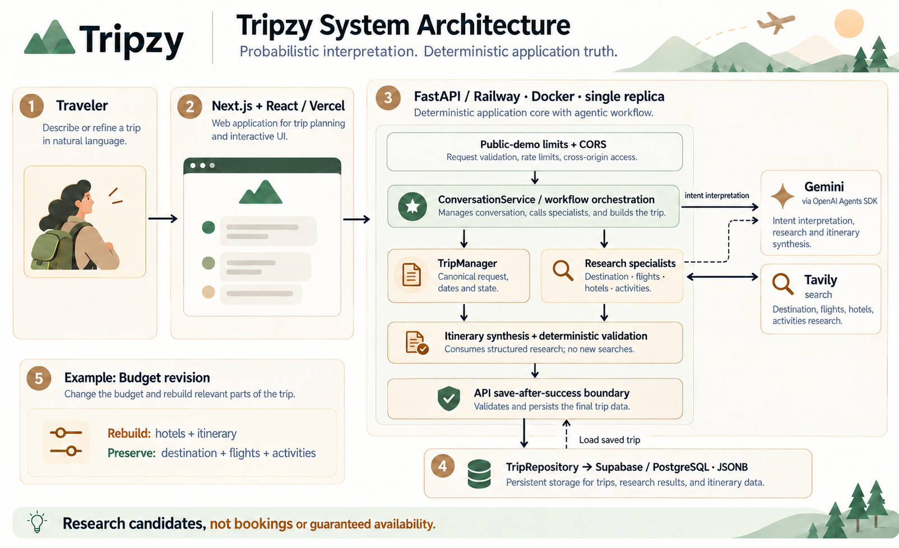
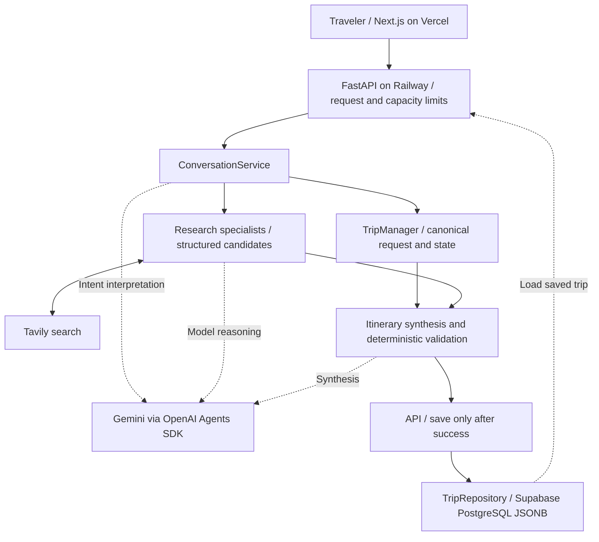

# Tripzy

[](https://github.com/hifzabuildsai/Tripzy/actions/workflows/ci.yml)

**Give me the trip. I’ll take it from here.**

Tripzy is a completed portfolio project by Hifza, built with AI-assisted development. It turns a natural-language travel mission into a durable trip workspace, research candidates and a structured day-by-day itinerary. The engineering focus is keeping saved state coherent when a traveler revises a plan or a provider fails.

**[Try the demo](https://tripzy-liard.vercel.app)** · [Watch the 89-second demo](https://github.com/user-attachments/assets/badc1551-7f3c-4a09-825c-d4b3ef807f50) · [Engineering case study](docs/portfolio-story.md) · [Verified demo acceptance](docs/p2-demo-acceptance.md) · [Model evaluation evidence](docs/evals.md) · [Résumé bullets](docs/resume.md) · [Interview walkthrough](docs/interview.md)

> **Engineering thesis:** LLMs interpret intent and perform bounded reasoning. Deterministic Python owns application truth: state, workflow, validation, selective invalidation, persistence, and retry semantics.

## Product preview

<p align="center">
  
</p>

<p align="center"><sub>One natural-language trip mission starts a durable planning workspace.</sub></p>

<table>
  <tr>
    <td width="50%">
      
      <br />
      <sub><b>Discover:</b> structured destination research organized for the traveler.</sub>
    </td>
    <td width="50%">
      
      <br />
      <sub><b>Itinerary:</b> a persisted day-by-day plan built from the researched artifacts.</sub>
    </td>
  </tr>
</table>

<details>
  <summary>Mobile itinerary preview</summary>
  <p></p>
</details>

Production captures from October 8, 2026, using the synthetic QA trip. These show researched planning output, not confirmed bookings. [Capture notes](docs/images/README.md).

## Why this project matters

The engineering challenge is keeping a persistent plan coherent when interpretation, external search, or a revision fails. Tripzy separates model decisions from application state, then validates and saves the result at explicit boundaries.

A traveler can describe a trip naturally, answer consolidated clarification when information is missing, refresh or reopen the durable trip URL, and later correct only part of the plan. Tripzy determines which downstream artifacts are affected and rebuilds only those dependencies.

Research results are candidates, not bookings or guaranteed live availability.

## Product flow

```text
Natural-language mission
        |
        v
ConversationService  <---- bounded LLM interpretation
        |
        v
TripManager           <---- deterministic application truth
        |
        +--> missing-information clarification
        |
        +--> destination research
        +--> flight research
        +--> hotel research
        +--> activity research
        |
        v
Structured itinerary
        |
        v
TripRepository --> Supabase PostgreSQL
        |
        +--> same durable trip URL
        +--> refresh/direct-link restore
        +--> selective replanning + retry
```

## Engineering decisions

### Deterministic state, agentic interpretation

The model can interpret a mission or correction, but it does not own `TripState`. Pydantic models and Python services own requirements, workflow progression, date semantics, status transitions, persisted state, and itinerary validation.

### Selective replanning

Corrections are converted into structured changes. A centralized dependency graph maps changed request fields to invalidated artifacts. For example, a budget change rebuilds the hotel options and itinerary; the application preserves interests when they are not part of the extracted correction. Model extraction can still introduce unrequested fields; the evaluation below measures that remaining limitation. Destination changes invalidate the full destination-dependent chain.

### Failure-safe persistence

Planning runs against state reconstructed from the repository. Updated state is persisted only after the planning operation succeeds. A failed revision therefore leaves the prior durable plan intact, and the same correction can be retried against that baseline.

### Research and planning stay separate

Destination, flight, hotel, and activity research produce structured candidates. The itinerary planner consumes those persisted research artifacts rather than silently performing another search. This keeps provenance and workflow responsibilities explicit.

## Architecture



The diagram shows logical responsibilities, not parallel execution. **ConversationService** coordinates interpretation and specialist workflows. **TripManager** owns canonical request/state and date semantics; Python's dependency graph determines which artifacts to rebuild. Gemini supports interpretation, research and itinerary synthesis through the OpenAI Agents SDK. Tavily supplies search to research specialists; itinerary synthesis consumes structured research and performs no new searches.

The **API save-after-success boundary** is distinct from state management. A planning request loads a saved baseline, processes changes in isolated working state, and persists the result through `TripRepository` only after successful processing. A failure leaves the previous saved state available. Missing requirements may return a clarification before research or itinerary synthesis; these branches are omitted from the overview image.

Production runs on **Vercel** (Next.js), **Railway** (one Dockerized FastAPI replica) and **Supabase** (PostgreSQL/JSONB). Provider credentials stay backend-only. `InMemoryTripRepository` is used by tests; production uses `SupabaseTripRepository`. The image's budget example assumes the interpreted correction changes only budget; unintended extracted edits remain a measured limitation.

<details>
<summary>Accessible architecture flow</summary>



</details>

## Stack

| Layer | Technology |
| --- | --- |
| Frontend | Next.js 16, React 19, TypeScript, Tailwind CSS, Motion |
| API | Python 3.12, FastAPI, Pydantic |
| Agentic AI | OpenAI Agents SDK with Gemini |
| Research | Tavily |
| Persistence | Supabase PostgreSQL, JSONB, RLS |
| Delivery | Docker, Railway, Vercel, GitHub Actions |
| Quality | pytest, Vitest, ESLint, pip-audit, reviewed npm audit policy, Gitleaks |

## Run locally

### Backend

```bash
git clone https://github.com/hifzabuildsai/Tripzy.git
cd Tripzy
python -m venv .venv
```

Activate the environment. Production and CI use Python 3.12 on Linux; the lockfile includes Linux-only dependencies such as uvloop. Use Linux/WSL for this locked install. For a Windows development environment, use `python -m pip install -e ".[dev]"` instead; that resolves the development dependencies rather than reproducing the Linux lockfile.

```bash
python -m pip install --require-hashes --requirement requirements.lock
python -m pip install pytest==9.1.1
```

Copy `.env.example` to `.env` and provide your own Gemini, Tavily, and Supabase credentials. Never commit backend secrets.

Run:

```bash
uvicorn app.api:app --reload
```

Development API: `http://127.0.0.1:8000`. Interactive API docs are intentionally available in development and disabled in production.

### Frontend

In another terminal:

```bash
cd frontend
npm ci
```

Copy `frontend/.env.example` to `frontend/.env.local`. Its default points to the local backend:

```env
NEXT_PUBLIC_TRIPZY_API_URL=http://127.0.0.1:8000
```

Then:

```bash
npm run dev
```

Open `http://localhost:3000`.

### Database bootstrap

Repository-owned Supabase migrations live in `supabase/migrations/`. Local reset and deny-by-default RLS verification are documented in [docs/database.md](docs/database.md).

## Quality and release evidence

The Release gate runs on pull requests and pushes to `main` and verifies:

- repository secret scanning
- locked Python dependencies and backend tests
- backend dependency audit
- frontend dependency audit, tests, lint, and production build
- Docker image build
- non-root image/runtime execution
- container startup and `/health`

[October 8 production acceptance](docs/p2-demo-acceptance.md) exercised a fresh five-day Istanbul plan, missing-detail clarification, refresh/direct URLs, desktop/mobile views, and a budget-only correction. Canonical before/after state showed only budget changed; destination research, flights and activities stayed identical while hotels and itinerary changed. Failure preservation and safe retry were checked with controlled regressions; the public service was not deliberately broken.

The existing regression suites contain **115 backend tests, 26 frontend tests and five audit-policy tests**. These counts establish regression coverage, not model accuracy. The frontend audit acknowledges one narrowly scoped dev-only braces advisory exception, expiring November 8, 2026; [the audit policy](docs/evals.md#release-gate-dependency-maintenance) documents its boundary.

### Measured model boundary

The [recorded portfolio baseline](evals/baselines/v1.0.0.md) uses 60 fixed cases × three repeats = 180 trials against Gemini, with synthetic search replay.

| Suite | Trials | Mean exact trial pass | Worst repeat |
| --- | --- | --- | --- |
| Intake extraction | 60 | 63.3% | 60.0% |
| Correction extraction | 90 | 90.0% | 90.0% |
| Itinerary invariants | 30 | 100.0% | 100.0% |

Intake precision was 85.8% and recall 78.5%. Correction unrequested-field fraction averaged 3.89%; the earlier 2% target was not met. One provider failure was recovered by resuming only that trial; quality failures and execution history were retained. Budget adherence was **unmeasured**, because comparable item costs were absent. These are local model-boundary measurements with a different Python/provider-library environment from production, not a live end-to-end travel benchmark. [Method, environment and failure examples](docs/evals.md).

The public demo includes bounded request/message sizes, a process-local write rate limit, bounded concurrent planning, planning timeout, exact-origin production CORS, redacted logging, production security headers, and disabled production OpenAPI/docs. These are demo safeguards rather than an authentication, WAF, or distributed quota system.

## Demo walkthrough

A compact portfolio demo can be run as follows:

1. Open the live product and submit a complete mission such as Karachi → Istanbul, 5 days, 2 travelers, a budget, and interests.
2. Show the resulting durable `/trips/<id>` workspace: brief, research, options, and itinerary.
3. Refresh the page or reopen the same URL to demonstrate persistence.
4. Submit a narrow revision such as “Change the budget to $2,500.” Show that the same trip ID remains and unrelated requirements are preserved.
5. Explain that Tripzy invalidates only dependent artifacts and persists the revised state only after successful replanning.

For a failure/retry demonstration, use a controlled development/test environment rather than intentionally breaking the public production service.

## Repository map

```text
app/
  agents/       bounded AI/research specialists
  models/       structured request, state, research and itinerary models
  services/     deterministic workflow, replanning and persistence boundaries
  tools/        travel-search and extraction capabilities
frontend/
  src/          Next.js product UI and persisted trip workspace
supabase/
  migrations/   production-matching database source of truth
tests/          backend workflow/API regression coverage
evals/          fixed datasets, runner and repeated baseline
docs/
  database.md   bootstrap + RLS verification
  deployment.md production environment + deployment contract
  portfolio-story.md architecture decisions + evidence + limitations
  resume.md     copy-ready project wording
  interview.md  introduction, walkthrough and technical Q&A
```

## Deployment and security

See [docs/deployment.md](docs/deployment.md) for the Railway/Vercel environment contract, container smoke test, live acceptance checks, and rollback boundary.

The browser receives only the public backend URL. Gemini, Tavily, and the privileged Supabase credential remain server-side. The `trips` table has RLS enabled with no direct anon/authenticated read policy; the trusted backend persistence layer is the database boundary.

## Limitations and intended use

- Travel results are research candidates. Prices, availability, opening hours, transit timing and a complete trip budget are not guaranteed; the live check found missing prices and mixed currencies.
- Extraction remains probabilistic. Partial-date over-specification, multilingual place-name mismatches and unrequested correction fields appear in the baseline. Multilingual support is not a shipped promise. Missing default-USD extraction evidence does not mean canonical state lost its USD default.
- The public demo has no account authentication or per-user authorization. Anyone with a trip URL can read or revise that trip. Use synthetic examples rather than sensitive travel details. Database RLS blocks direct client access; it does not authenticate the public API.
- Rate/concurrency controls assume one Railway replica. Same-trip concurrent updates lack a per-trip lock; this demo is not a distributed or multi-user collaboration system. `/health` checks the process, not downstream provider readiness.
- Evals use synthetic replay and a small fixed sample. One successful live route is a smoke check; neither establishes general travel accuracy or provider availability.

Voice, a live timeline, MCP, bookings and expanded multilingual features are deferred. The portfolio scope is the shipped planning flow plus verifiable engineering evidence. [Case study and tradeoffs](docs/portfolio-story.md).

## Portfolio status

**P1–P5 are complete and merged.** The package includes:

| Milestone | Shipped evidence |
| --- | --- |
| P1 · Evaluations | [60 fixed cases × three repeats](docs/evals.md) |
| P2 · Live acceptance | [Planning, clarification, persistence and revision checks](docs/p2-demo-acceptance.md) |
| P3 · Portfolio story | [Architecture, screenshots and honest limitations](docs/portfolio-story.md) |
| P4 · Recorded demo | [89-second walkthrough and verification](docs/p4-demo.md) |
| P5 · Presentation package | [Release record](docs/portfolio-release.md), [résumé wording](docs/resume.md), [interview walkthrough](docs/interview.md) |

The accepted repository checkpoint [v1.0.1](https://github.com/hifzabuildsai/Tripzy/releases/tag/v1.0.1) tags the P4 merge and preserves the original v1.0.0 tag. P5's presentation documents were merged afterward in [PR #16](https://github.com/hifzabuildsai/Tripzy/pull/16); they are available on main, not inside that tag. The eval baseline retains its original filename and measurement provenance. Deployment parity with the tag is not asserted.

The earlier empty `interests_replace: []` regression is fixed and covered by tests. The remaining extraction weaknesses and travel-feasibility gaps are documented above. This is the portfolio stopping point; the deferred v1.1 roadmap does not resume automatically.
