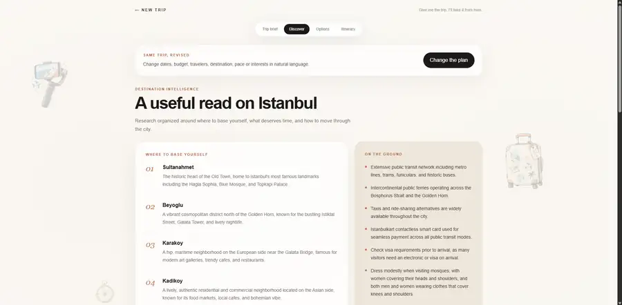
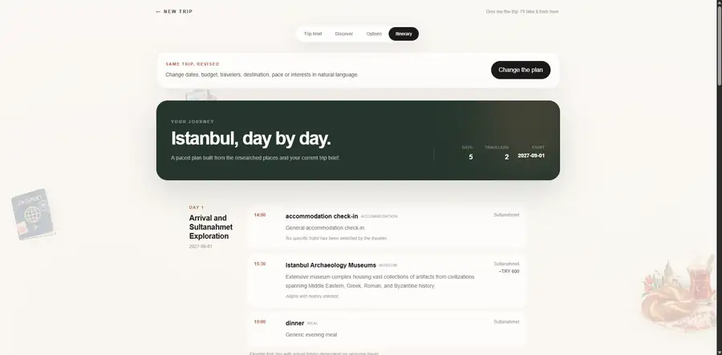

# Tripzy

[](https://github.com/hifzabuildsai/Tripzy/actions/workflows/ci.yml)

**Give me the trip. I’ll take it from here.**

Tripzy is a full-stack agentic travel planner that turns one natural-language mission into persisted requirements, researched travel options, activities, and a structured day-by-day itinerary.

**Live product:** https://tripzy-liard.vercel.app · **API health:** https://tripzy-api-production.up.railway.app/health

> **Engineering thesis:** LLMs interpret intent and perform bounded reasoning. Deterministic Python owns application truth: state, workflow, validation, selective invalidation, persistence, and retry semantics.

## Product preview

<p align="center">
  
</p>

<p align="center"><sub>One natural-language trip mission starts a durable planning workspace.</sub></p>

<table>
  <tr>
    <td width="50%">
      
      <br />
      <sub><b>Discover:</b> structured destination research organized for the traveler.</sub>
    </td>
    <td width="50%">
      
      <br />
      <sub><b>Itinerary:</b> a persisted day-by-day plan built from the researched artifacts.</sub>
    </td>
  </tr>
</table>

## Why this project matters

Tripzy is deliberately not a chatbot wrapped around a travel prompt. It is an exercise in putting probabilistic AI inside deterministic software boundaries.

A traveler can describe a trip naturally, answer consolidated clarification when information is missing, refresh or reopen the durable trip URL, and later correct only part of the plan. Tripzy determines which downstream artifacts are affected and rebuilds only those dependencies.

Research results are candidates, not bookings or guaranteed live availability.

## Product flow

```text
Natural-language mission
        |
        v
ConversationService  <---- bounded LLM interpretation
        |
        v
TripManager           <---- deterministic application truth
        |
        +--> missing-information clarification
        |
        +--> destination research
        +--> flight research
        +--> hotel research
        +--> activity research
        |
        v
Structured itinerary
        |
        v
TripRepository --> Supabase PostgreSQL
        |
        +--> same durable trip URL
        +--> refresh/direct-link restore
        +--> selective replanning + retry
```

## Engineering decisions

### Deterministic state, agentic interpretation

The model can interpret a mission or correction, but it does not own `TripState`. Pydantic models and Python services own requirements, workflow progression, date semantics, status transitions, persisted state, and itinerary validation.

### Selective replanning

Corrections are converted into structured changes. A centralized dependency graph maps changed request fields to invalidated artifacts. For example, a budget change rebuilds the hotel options and itinerary; it does not silently replace unrelated interests. Destination changes invalidate the full destination-dependent chain.

### Failure-safe persistence

Planning runs against state reconstructed from the repository. Updated state is persisted only after the planning operation succeeds. A failed revision therefore leaves the prior durable plan intact, and the same correction can be retried against that baseline.

### Research and planning stay separate

Destination, flight, hotel, and activity research produce structured candidates. The itinerary planner consumes those persisted research artifacts rather than silently performing another search. This keeps provenance and workflow responsibilities explicit.

## Architecture

```text
Browser / Next.js
       |
       v
FastAPI  ---- public-demo limits / CORS / security boundary
       |
       v
ConversationService
       |
       +--> TripManager ---------------------------+
       |       deterministic state + invariants   |
       |                                           |
       +--> specialist research workflows          |
       |       Gemini + OpenAI Agents SDK           |
       |       Tavily search                        |
       |                                           |
       +--> Itinerary Planner <--- structured data  |
       |                                           |
       v                                           |
TripRepository abstraction                         |
       |                                           |
       +--> InMemoryTripRepository (tests)          |
       +--> SupabaseTripRepository -----------------+
                    |
                    v
             PostgreSQL / JSONB
```

Production is split across **Vercel** (Next.js), **Railway** (Dockerized FastAPI), and **Supabase** (PostgreSQL). Gemini and Tavily are backend-only.

## Stack

| Layer | Technology |
| --- | --- |
| Frontend | Next.js 16, React 19, TypeScript, Tailwind CSS, Motion |
| API | Python 3.12, FastAPI, Pydantic |
| Agentic AI | OpenAI Agents SDK with Gemini |
| Research | Tavily |
| Persistence | Supabase PostgreSQL, JSONB, RLS |
| Delivery | Docker, Railway, Vercel, GitHub Actions |
| Quality | pytest, Vitest, ESLint, pip-audit, npm audit, Gitleaks |

## Run locally

### Backend

```bash
git clone https://github.com/hifzabuildsai/Tripzy.git
cd Tripzy
python -m venv .venv
```

Activate the environment, then install the locked runtime plus the test runner:

```bash
python -m pip install --require-hashes --requirement requirements.lock
python -m pip install pytest==9.1.1
```

Copy `.env.example` to `.env` and provide your own Gemini, Tavily, and Supabase credentials. Never commit backend secrets.

Run:

```bash
uvicorn app.api:app --reload
```

Development API: `http://127.0.0.1:8000`. Interactive API docs are intentionally available in development and disabled in production.

### Frontend

In another terminal:

```bash
cd frontend
npm ci
```

Copy `frontend/.env.example` to `frontend/.env.local`. Its default points to the local backend:

```env
NEXT_PUBLIC_TRIPZY_API_URL=http://127.0.0.1:8000
```

Then:

```bash
npm run dev
```

Open `http://localhost:3000`.

### Database bootstrap

Repository-owned Supabase migrations live in `supabase/migrations/`. Local reset and deny-by-default RLS verification are documented in [docs/database.md](docs/database.md).

## Quality and release evidence

The Release gate runs on pull requests and pushes to `main` and verifies:

- repository secret scanning
- locked Python dependencies and backend tests
- backend dependency audit
- frontend dependency audit, tests, lint, and production build
- Docker image build
- non-root image/runtime execution
- container startup and `/health`

Production acceptance has also exercised durable refresh/direct URLs, real research workflows, selective replanning, controlled failure preservation, and retry on the same trip ID.

The public demo includes bounded request/message sizes, a process-local write rate limit, bounded concurrent planning, planning timeout, exact-origin production CORS, redacted logging, production security headers, and disabled production OpenAPI/docs. These are demo safeguards rather than an authentication, WAF, or distributed quota system.

## Demo walkthrough

A compact portfolio demo can be run as follows:

1. Open the live product and submit a complete mission such as Karachi → Istanbul, 5 days, 2 travelers, a budget, and interests.
2. Show the resulting durable `/trips/<id>` workspace: brief, research, options, and itinerary.
3. Refresh the page or reopen the same URL to demonstrate persistence.
4. Submit a narrow revision such as “Change the budget to $2,500.” Show that the same trip ID remains and unrelated requirements are preserved.
5. Explain that Tripzy invalidates only dependent artifacts and persists the revised state only after successful replanning.

For a failure/retry demonstration, use a controlled development/test environment rather than intentionally breaking the public production service.

## Repository map

```text
app/
  agents/       bounded AI/research specialists
  models/       structured request, state, research and itinerary models
  services/     deterministic workflow, replanning and persistence boundaries
  tools/        travel-search and extraction capabilities
frontend/
  src/          Next.js product UI and persisted trip workspace
supabase/
  migrations/   production-matching database source of truth
tests/          backend workflow/API regression coverage
docs/
  database.md   bootstrap + RLS verification
  deployment.md production environment + deployment contract
```

## Deployment and security

See [docs/deployment.md](docs/deployment.md) for the Railway/Vercel environment contract, container smoke test, live acceptance checks, and rollback boundary.

The browser receives only the public backend URL. Gemini, Tavily, and the privileged Supabase credential remain server-side. The `trips` table has RLS enabled with no direct anon/authenticated read policy; the trusted backend persistence layer is the database boundary.

## Current release status

M18.3 Final Production QA identified and fixed one selective-replanning regression: an AI-produced empty `interests_replace: []` can no longer erase unrelated existing interests during a budget-only correction.

M18.4 packages the shipped product for portfolio review with architecture, engineering evidence, demo guidance, metadata, and production screenshots. The remaining milestone is the final production release lock.
