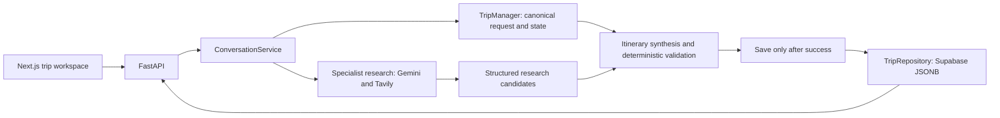

# Tripzy: engineering a durable AI travel planner

Tripzy is a portfolio project built and shipped by Hifza with AI-assisted
development. The work brings together a Next.js product, a FastAPI backend,
bounded AI/search workflows, persisted state, and a reproducible release gate.
The strongest engineering claim is the state boundary: probabilistic
interpretation feeds deterministic application code, with measured limitations.

[Live demo](https://tripzy-liard.vercel.app) · [Production acceptance](p2-demo-acceptance.md)
· [Evaluation method](evals.md) · [Raw baseline](../evals/baselines/v1.0.0.json)

## The problem and shipped experience

A travel assistant needs to remember a plan, ask for missing requirements and
handle corrections without discarding unrelated work. Generating a plausible
paragraph alone does not solve that workflow.

Tripzy collects origin, destination, exact dates or duration, travelers, budget,
interests and pace. Missing requirements appear in one consolidated clarification.
Once the request is ready, specialist workflows research the destination,
flights, hotels and activities. An itinerary planner consumes that structured
research. A durable trip URL restores the brief and artifacts after refresh.
The traveler can revise the same trip in natural language.

This is planning and candidate research. No reservations or purchases occur.

## Decisions that can be inspected in code

| Decision | Why it exists | Evidence |
| --- | --- | --- |
| Python owns canonical request/state | Model output must not define workflow truth or silently bypass invariants. | [TripManager](../app/services/trip_manager.py), [date semantics](../app/services/date_semantics.py) |
| Explicit artifact dependencies | A narrow correction should preserve unaffected work. | [Replanning graph](../app/services/replanning.py), [regressions](../tests/test_replanning.py) |
| Validate structured itinerary output | Dates, day counts and named activity eligibility can be checked deterministically. This does not validate opening hours or transit feasibility. | [Itinerary boundary](../app/services/itinerary_planning.py), [validator tests](../tests/test_itinerary_workflow.py) |
| Persist only after successful processing | A failed operation must not replace the last saved plan with partial state. | [API save boundary](../app/api.py), [failure/timeout tests](../tests/test_api.py) |
| Repository abstraction | Application services should not depend directly on database-specific behavior; tests need deterministic persistence. | [TripRepository](../app/services/trip_repository.py), [Supabase adapter](../app/services/supabase_trip_repository.py) |
| Separate research from itinerary synthesis | Planning consumes application-owned candidates instead of making new searches or implying bookings. | [Research services](../app/services/research.py), [itinerary agent](../app/agents/itinerary_planner.py) |
| Bound the public demo | Requests, provider calls and failures need explicit limits and redacted errors. | [Hardening](../app/hardening.py), [deployment contract](deployment.md), [CI](../.github/workflows/ci.yml) |

In production, Vercel serves the frontend, Railway runs one non-root Docker
backend, and Supabase stores trip state. Backend credentials stay server-side.
Database RLS denies direct anonymous/authenticated database access; the backend
credential bypasses RLS. That boundary is distinct from API authentication,
which the public demo does not implement.

## A concrete revision and a real regression

In the October 8 live check, a five-day Karachi → Istanbul mission produced
three flight candidates, five hotels, eight activities, four destination sources
and five dated itinerary days. The correction was:

> Change only the total budget to $2,500 USD.

A comparison of canonical saved state found only `budget` changed. Destination
research, flights and activities were JSON-identical. Hotels and itinerary were
regenerated, as their dependency graph requires. Refresh and a direct mobile
link restored the revised trip. This proves that example, not every possible
model interpretation.

An earlier budget-only revision exposed a concrete bug: the model emitted
`interests_replace: []`, which could erase existing interests. The application
now treats an empty replacement as omitted, while explicit non-empty replacement
and add/remove operations remain supported. Regression tests guard this behavior.
Other model-produced unrequested fields remain a measured limitation; the
application cannot automatically know whether every extracted edit matches intent.

## What the evidence establishes

| Evidence | Result | Boundary |
| --- | --- | --- |
| Deterministic regressions | 115 backend, 26 frontend, five audit-policy tests passed in P2. | Workflow/contracts under controlled inputs; not a model accuracy score. |
| Live acceptance | Planning, clarification, persistence, budget revision, mobile/desktop views, missing-trip recovery, HTTPS and exact-origin CORS passed. | Browser smoke check on a synthetic route; not load or exhaustive accessibility testing. |
| Intake eval | 20 cases × three repeats; mean exact trial pass 63.3%, worst repeat 60.0%; field precision 85.8%, recall 78.5%. | Serialized extraction boundary; default USD omission affects this score even when canonical state retains USD. |
| Correction eval | 30 cases × three repeats; exact trial pass 90.0%; unrequested-field fraction 3.89%; budget-only regression passed all three repeats. | The old 2% unrequested-field target was not met. |
| Itinerary eval | 10 synthetic research cases × three repeats; 100% tested invariant pass. | Thirty trials of structured output before production rejection; no complete budget or live feasibility claim. |

The portfolio subset was fixed before examining outputs and retains all dataset
languages. It is not the entire 110-case dataset or a promise of multilingual
product support. Search replay does not call Tavily. Gemini still runs live and
can fail or vary. One provider InternalServerError was recovered on resume;
quality failures and that earlier execution failure remain in the evidence.

Measurements used Python 3.14.6 and the recorded local provider-library versions;
production/CI use Python 3.12 and locked dependencies. Per-trial durations include
queue wait and are not standalone inference-latency benchmarks. All thirty
itinerary budget checks were unmeasured because comparable costs were absent.

## Honest limitations and tradeoffs

1. **Travel truth:** search candidates can contain stale prices, missing sources,
   incorrect descriptions or geography. The live smoke found absent flight prices
   and mixed-currency activity costs. Source links are inspectable; individual
   claims, availability, opening hours and transit feasibility were not independently
   established. There is no complete, currency-normalized trip total.
2. **Model interpretation:** partial dates can become too specific; local-script
   place names can miss canonical-name expectations; corrections can introduce
   unrequested fields. Deterministic validators reduce some failures without
   making interpretation universally accurate.
3. **Public-demo access:** trip IDs function as access links. There are no accounts,
   per-user API authorization, booking actions or payment flows. RLS alone does
   not protect a trip from someone who possesses its URL.
4. **Operational scope:** rate and capacity controls are process-local and assume
   one replica. Concurrent revisions to the same trip have no per-trip locking.
   `/health` establishes process health, not Supabase/Gemini/Tavily readiness.
   Provider latency and quotas can interrupt a demonstration.
5. **Security maintenance:** CI rejects blocking dependency findings under a
   reviewed policy. An existing unpatched dev-only braces advisory exception
   expires November 8, 2026; raw npm audit still reports it. Zero-advisory or
   comprehensive production-security claims would be inaccurate.

For a portfolio, the chosen stopping point is a bounded, deployed workflow with
visible evidence and documented limits. Voice, timeline, MCP, bookings and new
multilingual feature work are deferred. A larger system would first need better
extraction quality, comparable cost/feasibility evidence, access control and
concurrency guarantees. Those are future requirements, not shipped features.

## How to present the project

Lead with the durable workflow, then show the budget-only correction and saved
trip restoration. Explain the dependency graph and save-after-success boundary.
Use the regression tests to discuss failure safety; never deliberately break the
public service. Finish with the measured extraction weaknesses and the distinction
between a researched candidate and a feasible, bookable trip.

[Demo walkthrough](demo.md) is the basis for P4's short recording. P5 will package
the accepted release and resume/interview wording. Avoid unsupported claims about
users, conversion, speedups, cost savings, bookings or general planning accuracy.
